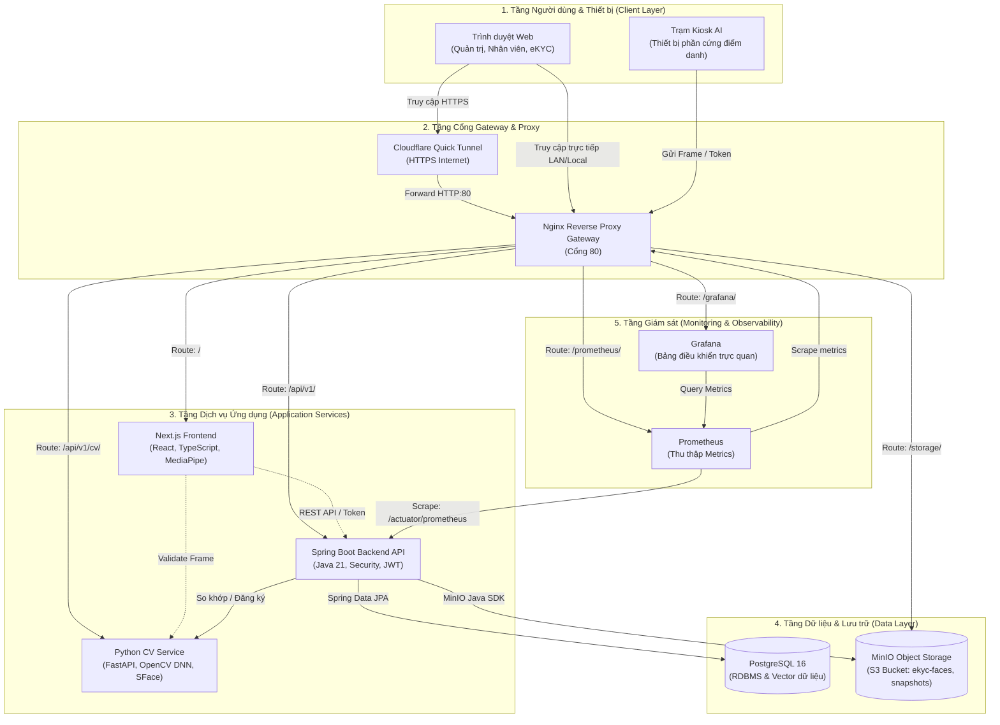

# Kiến trúc hệ thống (System Architecture)

Sơ đồ tổng quan về kiến trúc đa dịch vụ, luồng giao tiếp mạng và các thành phần
hạ tầng trong hệ thống eManagement.

## 1. Sơ đồ kiến trúc tổng thể

## 2. Bảng phân vùng chức năng và giao tiếp mạng

<table>
  <thead>
    <tr>
      <th>Tầng (Layer)</th>
      <th>Dịch vụ / Container</th>
      <th>Cổng nội bộ</th>
      <th>Đường dẫn qua Nginx</th>
      <th>Giao thức & Trách nhiệm</th>
    </tr>
  </thead>
  <tbody>
    <tr>
      <td><b>Gateway</b></td>
      <td>Nginx</td>
      <td>80</td>
      <td><code>/</code></td>
      <td>HTTP/HTTPS: Reverse proxy duy nhất, bảo vệ và phân luồng traffic nội bộ.</td>
    </tr>
    <tr>
      <td><b>Frontend</b></td>
      <td>Next.js App</td>
      <td>3000</td>
      <td><code>/</code></td>
      <td>HTTP: Render giao diện người dùng, điều phối luồng 5 bước eKYC client-side.</td>
    </tr>
    <tr>
      <td><b>Backend</b></td>
      <td>Spring Boot</td>
      <td>8080</td>
      <td><code>/api/v1/</code></td>
      <td>REST API: Xử lý nghiệp vụ nhân sự, phân ca, duyệt nghỉ, bảo mật JWT.</td>
    </tr>
    <tr>
      <td><b>AI Service</b></td>
      <td>Python CV Service</td>
      <td>8000</td>
      <td><code>/api/v1/cv/</code></td>
      <td>REST API: Liveness detection, Anti-spoofing FFT, trích xuất vector 128D.</td>
    </tr>
    <tr>
      <td><b>Database</b></td>
      <td>PostgreSQL</td>
      <td>5432</td>
      <td><i>Nội bộ Docker</i></td>
      <td>TCP/SQL: Lưu trữ dữ liệu quan hệ và vector embedding.</td>
    </tr>
    <tr>
      <td><b>Storage</b></td>
      <td>MinIO</td>
      <td>9000</td>
      <td><code>/storage/</code></td>
      <td>S3 API: Lưu trữ đối tượng ảnh crop eKYC và snapshot camera điểm danh.</td>
    </tr>
    <tr>
      <td><b>Monitoring</b></td>
      <td>Prometheus / Grafana</td>
      <td>9090 / 3000</td>
      <td>
        <code>/grafana/</code> 
        <code>/prometheus/</code>
      </td>
      <td>HTTP: Scrape metrics từ Actuator và hiển thị biểu đồ giám sát tài nguyên, SLA.</td>
    </tr>
  </tbody>
</table>
