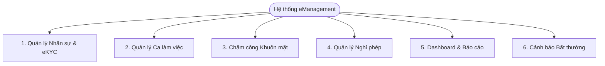
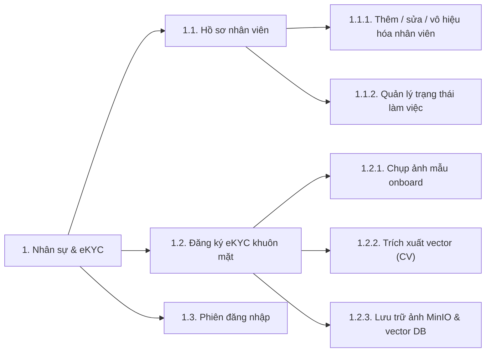
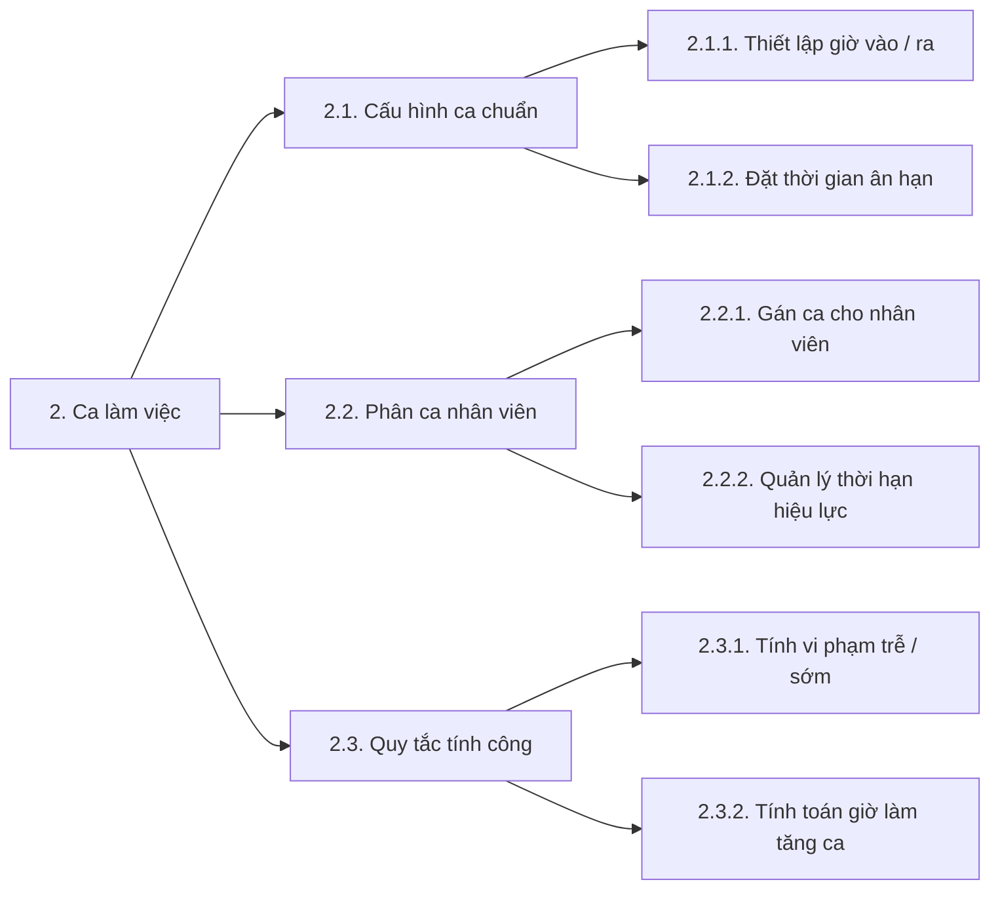
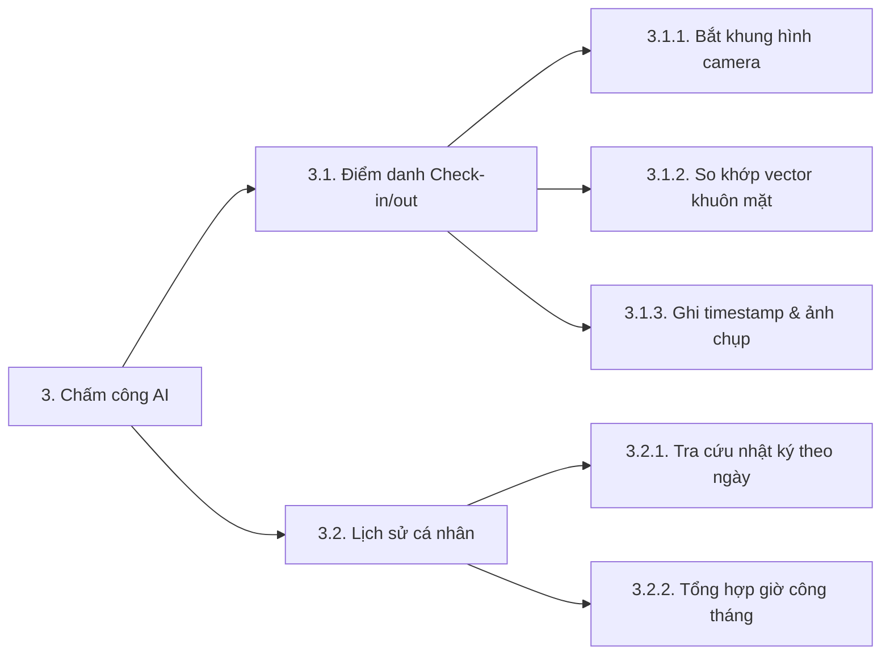
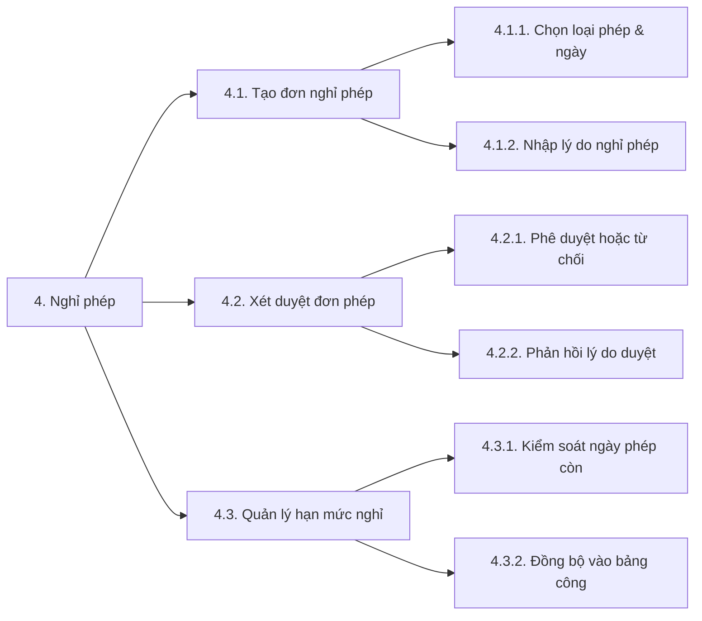
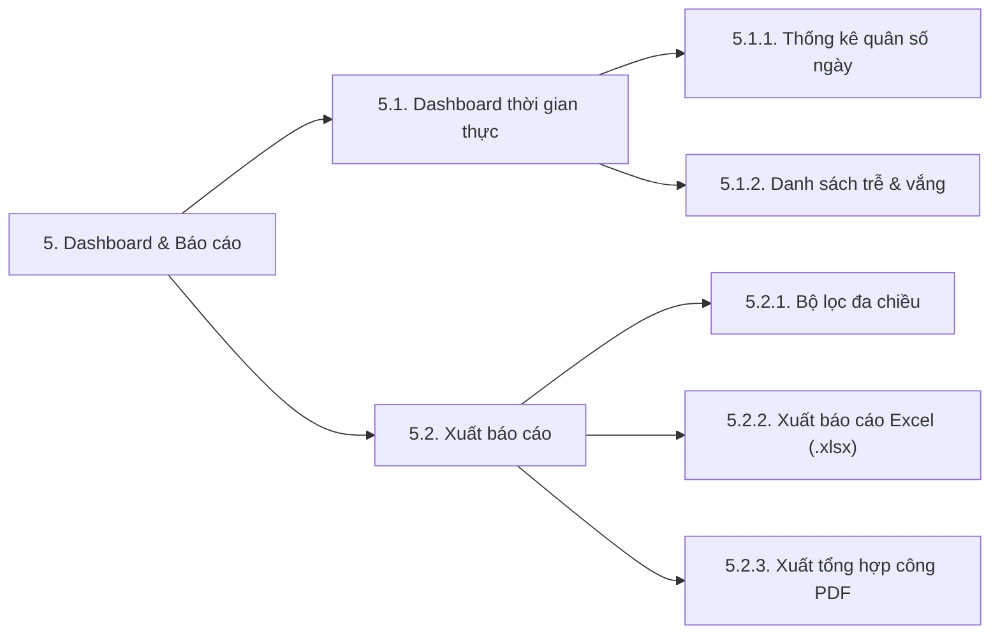
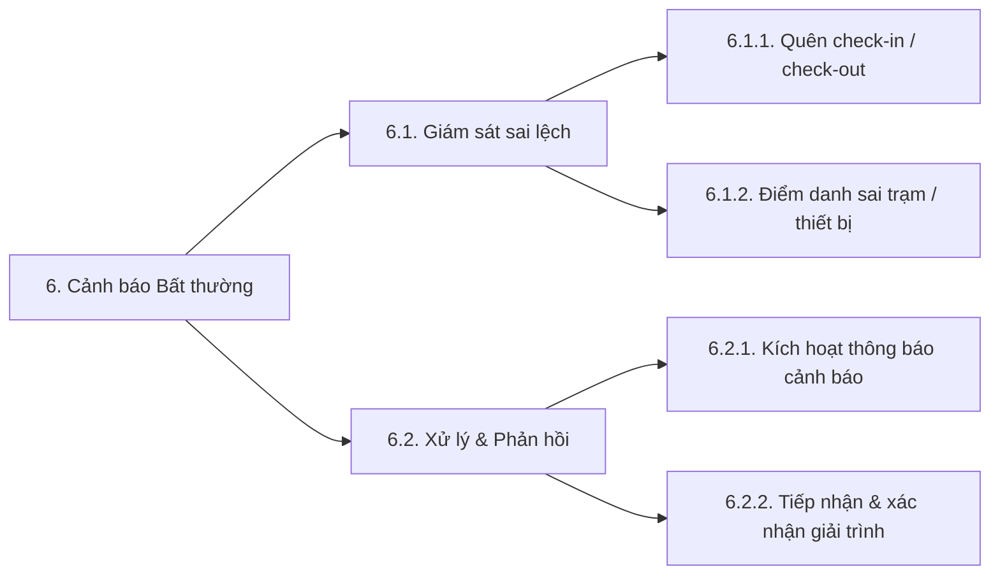

# Biểu đồ phân cấp chức năng (Functional Decomposition Diagram)

Tài liệu phân rã cấu trúc chức năng của hệ thống quản trị chấm công nhận diện
khuôn mặt (eManagement) theo mô hình phân tầng mô-đun (Modular Decomposition).

## 1. Sơ đồ phân rã tổng quan (Level 0 - Level 1)

Sơ đồ thể hiện 6 phân hệ nghiệp vụ chính của hệ thống:

## 2. Chi tiết phân rã từng phân hệ chức năng (Level 1 - Level 3)

### 2.1. Phân hệ Quản lý Nhân sự & eKYC (HR & Identity Management)

### 2.2. Phân hệ Quản lý Ca làm việc (Shift Management)

### 2.3. Phân hệ Chấm công Khuôn mặt (AI-based Attendance Tracking)

### 2.4. Phân hệ Quản lý Nghỉ phép (Leave Management)

### 2.5. Phân hệ Dashboard & Báo cáo (Dashboard & Reporting)

### 2.6. Phân hệ Cảnh báo Bất thường (Anomaly Alerting)

