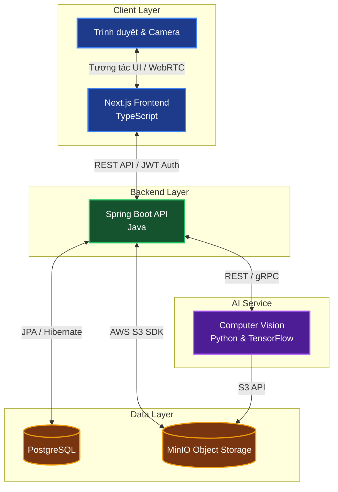

# System Architecture

Sơ đồ tổng quan về kiến trúc các luồng dịch vụ và giao tiếp hạ tầng của hệ thống
quản lý chấm công.

```mermaid
graph TD
    subgraph Client Layer
        Browser[Trình duyệt & Camera]
        NextJS[Next.js Frontend\nTypeScript]
        Browser <-->|Tương tác UI / WebRTC| NextJS
    end

    subgraph Backend Layer
        SpringBoot[Spring Boot API\nJava]
        NextJS <-->|REST API / JWT Auth| SpringBoot
    end

    subgraph AI Service
        PythonCV[Computer Vision\nPython & TensorFlow]
        SpringBoot <-->|REST / gRPC| PythonCV
    end

    subgraph Data Layer
        PostgreSQL[(PostgreSQL)]
        MinIO[(MinIO Object Storage)]

        SpringBoot <-->|JPA / Hibernate| PostgreSQL
        SpringBoot <-->|AWS S3 SDK| MinIO
        PythonCV -->|S3 API| MinIO
    end

    %% Styles
    classDef frontend fill:#1e3a8a,stroke:#3b82f6,color:#fff,stroke-width:2px
    classDef backend fill:#14532d,stroke:#22c55e,color:#fff,stroke-width:2px
    classDef ai fill:#4c1d95,stroke:#a855f7,color:#fff,stroke-width:2px
    classDef db fill:#78350f,stroke:#f59e0b,color:#fff,stroke-width:2px

    class Browser,NextJS frontend
    class SpringBoot backend
    class PythonCV ai
    class PostgreSQL,MinIO db
```
